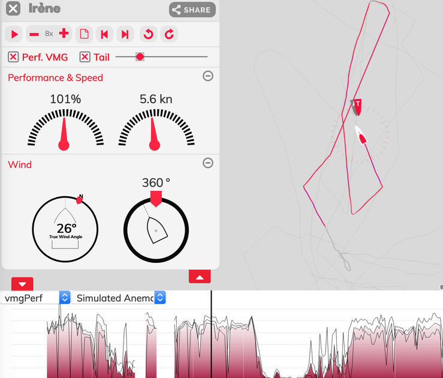

Anemomind: a sailing data recording, visualization and analysis solution.

## Components:

  * a web server (visible on [anemolab](https://anemolab.com) and [Regatta Polar](https://regattapolar.it/))
  * an optional onboard computer system (called 'anemobox')
  * c++ code to compute performance statistics and predictions
  * an iOS app.

The solution is described [on Anemomind web site](http://www.anemomind.com/).

## Features:

  * visualize sailing logs, including wind data on a web page.
  * works on mobile.
  * automatic true-wind calibration based on uploaded logs.
  * computes VMG performance estimations based on logged data.
  * supports NMEA0183, NMEA 2000, and other formats.



# How can I test it?

The easiest is to test it on [anemolab](https://anemolab.com/). Simply create
an account, create a boat, and upload some data.

If you want to test it on your local machine, the easiest is to use docker-compose, see below.

# Where to start reading the sources?

  *  For the C++ processing code, start by reading the
     [main processing function](https://github.com/jpilet/anemomind/blob/master/src/server/nautical/BoatLogProcessor.cpp#L326).
  *  For the anemobox (the embedded device), see the [nodejs entry point](https://github.com/jpilet/anemomind/blob/master/src/device/anemobox/anemonode/main.js).
  *  The web server is [there](https://github.com/jpilet/anemomind/tree/master/src/server)
  *  The angular js web client code is [here for anemolab](https://github.com/jpilet/anemomind/tree/master/www2/client)
     and [there for Regatta Polar](https://github.com/jpilet/anemomind/tree/master/www2/esalab).
  *  The iOS app is not is this repo. The code will be published soon.

You can contact me at julien@anemomind.com and send questions.

# Running with docker-compose

The following process use existing docker images to start running the web server.

1. Install docker.
2. Install docker-compose.
3. ``` git clone https://github.com/jpilet/anemomind.git ```
4. Run ``` ./src/bootstrap-docker-compose.sh ``` from the anemomind directory.
5. Wait a bit, and browse to [http://localhost:9000/](http://localhost:9000/).

To build the docker images, use ```./src/build_docker_prod.sh <tag>```

# Using docker for c++  development

The following command will build a docker image and compile all the c++ code.
```
./src/compile_in_docker.sh
```

You can run any command in the development environment with:
```
./src/docker_run.sh <docker flags> <command>
```
For example:
```
./src/docker_run.sh -it bash
```
will open a shell in which you can type ```make -j8 && make test```.

# Using the Vagrant box for development
```
vagrant up
vagrant provsion (should be done first time only or if you make any changes in vagrant file)
vagrant ssh
```

# Development without Docker setup guide

To build the cpp code in release mode:
```
mkdir build_release
cd build_release
cmake .. -DCMAKE_BUILD_TYPE=RelWithDebInfo
make -j$(nproc)
```
*If you get a compilation error*, you can try to call ```make -j 4``` again until everything builds with no errors.
Instead of ```RelWidthDebInfo```, it is possible to use or ```Debug``` (removes optimisations).

To build the test database:

1. Start mongo with ```mkdir -p www/db ; mongod -bind_ip 127.0.0.1 -dbpath www/db```
2. Once mongo is running, run (and wait a bit):

```
build_release/src/server/nautical/tiles/generateDevDB.sh
```
  You can safely ignore errors such as "file empty or format not recognized."

If you dont find any data in the mongo db after the UI is up and running plase re-run the last command to generate the db.

3. Now prepare the web server:
```
cd www2
mkdir uploads
npm install
bower install
```
4. Kill mongodb (this is necessary because grunt will start a new instance) ```killall mongod```
5. start the dev server:
```
CLIENT=client grunt serve:dev
```
Note that you can replace ```CLIENT=client``` with ```CLIENT=esalab```. The
code name 'client' corresponds to anemolab.com site, and 'esalab' corresponds to
regattapolar.it.

## Reference platform
The system compiles **at least** under Ubuntu 64-bit and Mac OSX 64-bit.

## Required dependencies:
### For C++
  * Eigen 3
  * C++ compiler, such as GCC or LLVM/Clang
  * CMake build system.
  * Boost libraries: libboost-iostreams-dev, libboost-filesystem-dev, libboost-system-dev, libboost-regex-dev,
    libboost-thread-dev, libboost-dev
  * The following packages, used by POCO:
    libssl-dev, ~~unixodbc-dev, libmysqlclient-dev,~~ libkrb5-dev
  * The following packages, used by Ceres: libeigen3-dev libsuitesparse-dev libcsparse2.2.3 libcxsparse2.2.3
  * Used by Armadillo: liblapack-dev, libblas-dev, libatlas3-base. See this page for help setting it up:
    http://danielnouri.org/notes/2012/12/19/libblas-and-liblapack-issues-and-speed,-with-scipy-and-ubuntu/
  * Armadillo
  * gnuplot (only necessary if you want to plot)
  * libprotobuf-dev
  * protobuf-compiler
  * cairo


Summary:

On debian/ubuntu:

    sudo apt-get install cmake libboost-iostreams-dev libboost-filesystem-dev libboost-system-dev libboost-regex-dev libboost-thread-dev libboost-dev libeigen3-dev libsuitesparse-dev libcxsparse3 liblapack-dev libblas-dev libatlas3-base libprotobuf-dev  protobuf-compiler libssl-dev libcairo2-dev build-essential git libarmadillo-dev f2c parallel mongodb-clients catdoc clang libicu-dev libpython2.7 libsqlite3-dev build-essential cmake libblkid-dev e2fslibs-dev libboost-all-dev libaudit-dev libeigen3-dev libcairo2-dev libblas-dev liblapack-dev libarmadillo-dev libceres-dev

additionally, swift has to be installed: see https://www.cansurmeli.com/posts/install-swift-on-debian/

On macOS with macports:

    sudo port install cairo cmake eigen3 f2c armadillo protobuf-cpp catdoc

### For the web server
  * **node** and **npm**. Find packages here: ```https://nodejs.org/en/download/package-manager/```
  * **mocha**, for running unit tests: ```npm install -g mocha``` (possibly with ```sudo```)
  * **bower**, install with ```npm install -g bower``` (possibly with ```sudo```)
  * **grunt**, install with ```npm install -g grunt```, or should it be ```grunt-cli```? Try out yourself. (possibly with ```sudo```)

## Dependencies that are fetched automatically:
  * gtest
  * ADOL-C
  * POCO
  * ceres
  * mongodb c++ client

## Summary of steps to get started
The following steps cover building and testing all the code:
  1. Install dependencies
  2. Clone this repository
  3. From the root directory,
     ```mkdir build```
  4. ```cd build```
  5. ```cmake ../```
  6. ```make -j N```
     where ```N``` is the number of cores, e.g. 8
  7. ```make test```
  8. ```cd ../www2```
  9. ```npm install```
  10. ```bower install```
  11. ```grunt test```
  12. ```mocha```
  13. ```cd ../nodemodules/endpoint```
  14. ```npm install```
  15. ```mocha```
  16. ```cd ../mangler```
  17. ```npm install```
  18. ```mocha```
  19. ```cd ../../src/device/anemobox/anemonode/```
  20. ```npm install```
  21. ```mocha```

## Additional tests
Some things are difficult to test with unit tests. The pipeline that
processes logs and upload tiles can be run, by first ensuring a that
a clean mongo server is running either
```
sudo killall mongod
mkdir /tmp/anemotestdb
mongod --dbpath /tmp/anemotestdb
```
or by doing from the project root
```
mkdir www/db
cd www2
grunt serve:dev
```

Then perform a build of the C++ code in your build directory (e.g. ```build```),
and run
```
build/src/server/nautical/tiles$ sh generateDevDB.sh
```
Although this will not perform any correctness checks in particular, a great deal of the pipeline will nevertheless be run and it can therefore be a conventient tool when searching for bugs.

If you used the second example for starting mongodb indirectly using grunt ```grunt serve:dev```, the result will be visible on http://localhost:9000.


# Running in interactive shell ROOT

Install CERN's ROOT. On mac, do it with: ```sudo port install root6```
Then got to the build folder and type:
```make root```

To check that it worked, you can type:
```NavDataset().outputSummary(&std::cout)```


## Dockerized anemomind
[DokcerREADME.md](DockerREADME.md)
